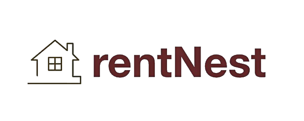

# restNest

Welcome to restNest, your ultimate destination for finding cozy accommodations around the world. Whether you're planning a weekend getaway or a long-term stay, restNest offers a wide range of listings to suit every traveler's needs.



---

## Features

- **Search and Discover**: Easily search for accommodations in Nepal based on location, dates, and preferences.
- **Host Listings**: Detailed property listings with titles, descriptions, images, prices, and locations.
- **Responsive Design**: Optimized for seamless use across devices.
- **Reviews and Ratings**: Transparent feedback system for informed decisions.

---

## Technologies Used

- **Frontend**: HTML, CSS, JavaScript (ES6)
- **Backend**: Node.js, Express.js
- **Database**: MongoDB
- **Templating Engine**: EJS (Embedded JavaScript)
- **UI Components**: Sliding.js
- **Cloud Services**: Cloudinary
- **Authentication and Authorization**: Passport.js
- **Architecture**: MVC Model
- **Deployment**: Render (Hosted at [restnest.onrender.com](https://restnest.onrender.com))

---

## Getting Started

### Prerequisites

- Node.js (v14.x or higher)
- MongoDB (v4.x or higher)

### Installation

1. Clone the repository:

   ```bash
   git clone https://github.com/RomanChhatkuli/restNest.git
   cd restNest

2. Install dependencies:

   ```bash
   npm install
   
3. Create a .env file and add your MongoDB URI and other environment variables:

   ```bash
   MONGODB_URI=your_mongodb_uri
   CLOUDINARY_CLOUD_NAME=your_cloud_name
   CLOUDINARY_API_KEY=your_api_key
   CLOUDINARY_API_SECRET=your_api_secret
   
4. Start the application:

   ```bash
   node app.js


## Usage

Once the application is running, you can access it at [http://localhost:8080](http://localhost:8080).


## License

This project is licensed under the MIT License. See the [LICENSE](LICENSE) file for details.
